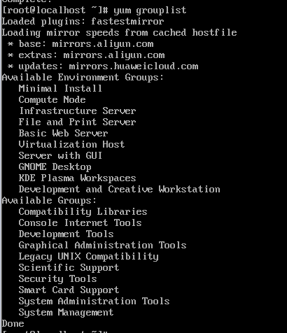
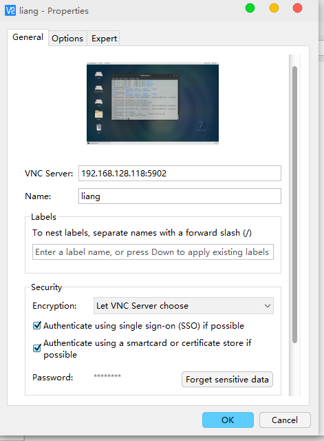

> CentOS7 从新装到常用软件、常用配置指令等的配置笔记
>
> [TOC]

<!-- more -->

## 一、 安装图形界面

```bash
# 安装 "X Window System"
yum groupinstall "X Window System" -y
# 查看支持的软件（已安装的和可安装的）
yum grouplist
```



```bash
# 安装图形界面
yum groupinstall "GNOME Desktop" "Graphical Administration Tools" -y
# 启动图形界面
startx
```

> 可能遇到的报错
>
> 
>
> 分析出错提示可以看出是在安装fwupdate-efi-12-5.e17.centosx86_64这个软件包时和系统自带的grub2-common1:2.02-0.64.e17.centos.noarch软件包有冲突。将该包更新，然后安装fwupdate-efi-12-5.e17.centosx86_64。最后重新执行“X Window System”安装。测试如下：
>
> ```bash
> yum update grub2-commonn
> yum install fwupdate-efi -y
> ```

## 二、相关软件安装配置

### 1、VNC 远程连接配置

> vnc安装与配置

```bash
# 检查是否已安装vnc相关服务
ps -eaf | grep vnc
# 检查 vnc相关的包是否已安装
rpm -qa | grep vnc
# 安装 vncviewer,vncserver， 我使用的 yum -y install vnc *vnc-server*
# 部分设置参数文件位置为 /lib/systemd/system/vncserver@.service
yum install tigervnc-vncserver vnc
# 添加端口，vnc默认从5901端口开始，用户1位5901，用户2位5902，以此类推
firewall-cmd --zone=public --add-port=5901/tcp --permanent
# 重新载入配置参数
firewall-cmd --reload
# 启动 vnc 服务器,首次启动会要求输入密码，同时会提示是否设置一个只可以查看，但无法操作的密码
# 相关参数可以通过help指令获取
vncserver -geometry 1440x900 # 注意，默认以当前用户创建远程服务
# 关闭 vncserver
vncserver -kill :2
```

> 客户端连接，如windows
>
> [客户端下载地址](https://www.realvnc.com/en/connect/download/viewer/)
>
> 其中 VNC Server 可以填写 ip:port  也可以 ip:用户序号
>
> 如`192.168.128.118:1` `192.168.128.118:5901` `192.168.128.118::5901`(两个冒号也可以...)



## 三、防火墙操作

> 人懒，直接转载别人的 https://www.cnblogs.com/moxiaoan/p/5683743.html，侵删
>
> 1. firewalld的基本使用
>
> 启动： systemctl start firewalld
>
> 关闭： systemctl stop firewalld
>
> 查看状态： systemctl status firewalld 
>
> 开机禁用  ： systemctl disable firewalld
>
> 开机启用  ： systemctl enable firewalld
>
> 2. systemctl是CentOS7的服务管理工具中主要的工具，它融合之前service和chkconfig的功能于一体。
>
> 启动一个服务：systemctl start firewalld.service
> 关闭一个服务：systemctl stop firewalld.service
> 重启一个服务：systemctl restart firewalld.service
> 显示一个服务的状态：systemctl status firewalld.service
> 在开机时启用一个服务：systemctl enable firewalld.service
> 在开机时禁用一个服务：systemctl disable firewalld.service
> 查看服务是否开机启动：systemctl is-enabled firewalld.service
> 查看已启动的服务列表：systemctl list-unit-files|grep enabled
> 查看启动失败的服务列表：systemctl --failed
>
> 3. 配置firewalld-cmd
>
> 查看版本： firewall-cmd --version
>
> 查看帮助： firewall-cmd --help
>
> 显示状态： firewall-cmd --state
>
> 查看所有打开的端口： firewall-cmd --zone=public --list-ports
>
> 更新防火墙规则： firewall-cmd --reload
>
> 查看区域信息:  firewall-cmd --get-active-zones
>
> 查看指定接口所属区域： firewall-cmd --get-zone-of-interface=eth0
>
> 拒绝所有包：firewall-cmd --panic-on
>
> 取消拒绝状态： firewall-cmd --panic-off
>
> 查看是否拒绝： firewall-cmd --query-panic
>
> 4. 端口配置
>
> 添加
>
> firewall-cmd --zone=public --add-port=80/tcp --permanent    （--permanent永久生效，没有此参数重启后失效）
>
> 重新载入
>
> firewall-cmd --reload
>
> 查看
>
> firewall-cmd --zone=public --query-port=80/tcp
>
> 删除
>
> firewall-cmd --zone=public --remove-port=80/tcp --permanent

## 四、主题优化

