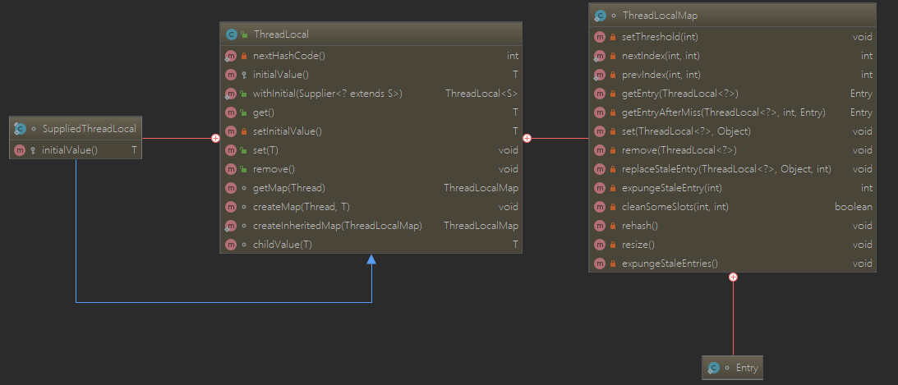

> ThreadLocal 类粗读

<!-- more -->

> 了解 ThreadLocal 先了解其类和接口关系
> 内部类 ThreadLocalMap 以及 SuppliedThreadLocal



> ThreadLocal是一个本地线程副本变量工具类。主要用于将私有线程和该线程存放的副本对象做一个映射，各个线程之间的变量互不干扰**(ThreadLocal在每个线程中对该变量会创建一个副本，即每个线程内部都会有一个该变量，且在线程内部任何地方都可以使用，线程之间互不影响,由于在每个线程中都创建了副本，所以要考虑它对资源的消耗)**。在高并发场景下，可以实现无状态的调用，特别适用于各个线程依赖不同的变量值完成操作的场景。

## ThreadLocal 与 Thread

> 在线程初始化时，会进行判断，如果父进程的 inheritableThreadLocals 不为空，且允许继承，则会自动将该值复制给子进程

```java
if (inheritThreadLocals && parent.inheritableThreadLocals != null)
            this.inheritableThreadLocals =
                ThreadLocal.createInheritedMap(parent.inheritableThreadLocals); 

/* ThreadLocal values pertaining to this thread. This map is maintained
     * by the ThreadLocal class. 
     // 用于存储当前线程的 ThreadLocalMap 对象
     */
    ThreadLocal.ThreadLocalMap threadLocals = null;
    /*
     * InheritableThreadLocal values pertaining to this thread. This map is
     * maintained by the InheritableThreadLocal class.
     	用于存储父进程的 ThreadLocalMap 对象
     	在 Thread 初始化时，会进行判断
    if (inheritThreadLocals && parent.inheritableThreadLocals != null)
                this.inheritableThreadLocals =
                    ThreadLocal.createInheritedMap(parent.inheritableThreadLocals); 
     */
    ThreadLocal.ThreadLocalMap inheritableThreadLocals = null;
```

## 初始化

```java
// 一般在首次使用 get() 方法的时候会调用: get()-->setInitialValue()-->initialValue
protected T initialValue() {
        return null;
}
public static <S> ThreadLocal<S> withInitial(Supplier<? extends S> supplier) {
        return new SuppliedThreadLocal<>(supplier);
}
 public ThreadLocal() {
 }

```

## get

> 刚初始化时，map未初始化，使用 get 方法，会向 map 添加 (cur_threadlocal_instance,null)值，并返回 null
> 若 map 已初始化，

```java
 public T get() {
        Thread t = Thread.currentThread();
        ThreadLocalMap map = getMap(t);
        if (map != null) {
            ThreadLocalMap.Entry e = map.getEntry(this);// this 为对应 ThreadLocal 实例
            if (e != null) {
                @SuppressWarnings("unchecked")
                T result = (T)e.value;
                return result;
            }
        }
        return setInitialValue();
 }
private T setInitialValue() {
        T value = initialValue(); // 返回 null
        Thread t = Thread.currentThread();
        ThreadLocalMap map = getMap(t); // 获取当前线程的 map (ThreadLocalMap实例)
        if (map != null)
            map.set(this, value); // 不为空则添加 (调用者, null) 键值对
        else
            createMap(t, value); // map 尚未初始化，进行初始化
        return value;
}
```


## nextHashCode

> 每次新增一个 ThreadLocal 实例，增加 HASH_INCREMENT = 0x61c88647 ，然后 & (INITIAL_CAPACITY - 1) 取得在数组  private Entry[] table 中的索引。

```java
private final int threadLocalHashCode = nextHashCode();
private static AtomicInteger nextHashCode = new AtomicInteger();// 初始化为0，整形，cas原子类
private static final int HASH_INCREMENT = 0x61c88647;
// 由于是类成员，每次增加一个 ThreadLocal 对象，都会加 HASH_INCREMENT，以做到对象hash值不同
private static int nextHashCode() { 
        return nextHashCode.getAndAdd(HASH_INCREMENT); // 增加操作
}
```

