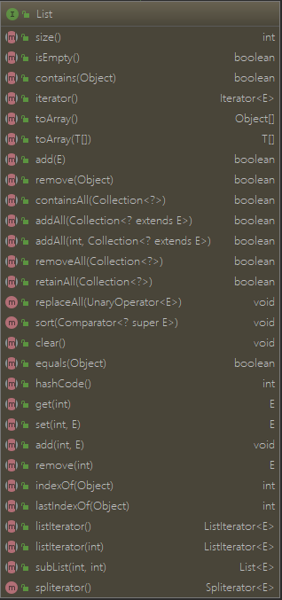

> List ArrayList 源码阅读

<!-- more -->

​                        =======> 

## List

### sort

> 排序方法，先转换为数组，使用Arrays.sort() 进行排序。一般通过匿名内部类传入比较器，排序完成后，通过迭代器完成赋值。

```java
default void sort(Comparator<? super E> c) {
    Object[] a = this.toArray();
    Arrays.sort(a, (Comparator) c);
    ListIterator<E> i = this.listIterator();
    for (Object e : a) {
        i.next();
        i.set((E) e);
    }
}
```

## ArrayList

### 成员变量

```java
// 默认容量， 10 
private static final int DEFAULT_CAPACITY = 10;
// 空数组实例
 private static final Object[] EMPTY_ELEMENTDATA = {};
// DEFAULTCAPACITY_EMPTY_ELEMENTDATA 与 EMPTY_ELEMENTDATA 区别在于初始化不同，可以在构造方法中得到答案
private static final Object[] DEFAULTCAPACITY_EMPTY_ELEMENTDATA = {};
// 数组最大的长度，有些虚拟机在数组中有保存头部信息，因而分配过大的内存，会导致 OutOfMemoryError 错误
private static final int MAX_ARRAY_SIZE = Integer.MAX_VALUE - 8;
```

### 构造器

> 从构造方法中可以看大，elementData = EMPTY_ELEMENTDATA 的情况都是 initialCapacity 值已知的情况。而  elementData = DEFAULTCAPACITY_EMPTY_ELEMENTDATA 时，对 initialCapacity 未做处理，相当于一种特殊的标记。这个和类的设计者想法有关，只能说这个标记方法比较秀。

```java
public ArrayList(int initialCapacity) {
    if (initialCapacity > 0) {
        this.elementData = new Object[initialCapacity];
    } else if (initialCapacity == 0) {
        this.elementData = EMPTY_ELEMENTDATA;
    } else {
        throw new IllegalArgumentException("Illegal Capacity: "+
                                           initialCapacity);
    }
}
public ArrayList() {
    this.elementData = DEFAULTCAPACITY_EMPTY_ELEMENTDATA;
}
public ArrayList(Collection<? extends E> c) {
    elementData = c.toArray();
    if ((size = elementData.length) != 0) {
        // c.toArray might (incorrectly) not return Object[] (see 6260652)
        if (elementData.getClass() != Object[].class)
            elementData = Arrays.copyOf(elementData, size, Object[].class);
    } else {
        // replace with empty array.
        this.elementData = EMPTY_ELEMENTDATA;
    }
}
```

### trimToSize

> 用于压缩，将多余的空元素去除
> 新建长度为size 的数组，并将前size个元素复制，然后替换引用。

```java
public void trimToSize() {
    modCount++;
    if (size < elementData.length) {
        elementData = (size == 0)
          ? EMPTY_ELEMENTDATA
          : Arrays.copyOf(elementData, size);
    }
}
```

### ensureCapacity -> grow

> ensureCapacity : 用做扩容，

```java
public void ensureCapacity(int minCapacity) {
    // 如果 elementData 不是 DEFAULTCAPACITY_EMPTY_ELEMENTDATA，说明已经对 容量大小进行了初始化
    // 否则，minExpand 取值为默认值 DEFAULT_CAPACITY 10
    int minExpand = (elementData != DEFAULTCAPACITY_EMPTY_ELEMENTDATA)? 0: DEFAULT_CAPACITY;
	// 若输入大小大于 minExpand,进行扩容操作
    if (minCapacity > minExpand) {
        ensureExplicitCapacity(minCapacity);
    }
}
private void ensureCapacityInternal(int minCapacity) {
    if (elementData == DEFAULTCAPACITY_EMPTY_ELEMENTDATA) {
        // 初始化，选择DEFAULT_CAPACITY 与 minCapacity 的更大值
        minCapacity = Math.max(DEFAULT_CAPACITY, minCapacity);
    }
  // 保证容量大小合适，避免扩容完没有空位添加值，
    ensureExplicitCapacity(minCapacity);
}

private void ensureExplicitCapacity(int minCapacity) {
    modCount++;

    // overflow-conscious code 避免溢出
    if (minCapacity - elementData.length > 0)
        grow(minCapacity); // 一般情况下，扩容为乘以 1.5 倍
}
private void grow(int minCapacity) {
    // overflow-conscious code
    int oldCapacity = elementData.length;
    // 新的容量是旧的容量的 1.5 倍
    int newCapacity = oldCapacity + (oldCapacity >> 1);
    if (newCapacity - minCapacity < 0)// 避免溢出
        newCapacity = minCapacity;
    if (newCapacity - MAX_ARRAY_SIZE > 0) // 避免超过最大值
        newCapacity = hugeCapacity(minCapacity);
    // minCapacity is usually close to size, so this is a win:
    elementData = Arrays.copyOf(elementData, newCapacity);
}
private static int hugeCapacity(int minCapacity) {
    if (minCapacity < 0) // overflow 
        throw new OutOfMemoryError();
    return (minCapacity > MAX_ARRAY_SIZE) ? Integer.MAX_VALUE : MAX_ARRAY_SIZE;
}
```

### indexOf / contains

> 使用 indexOf 遍历查找对应的值，如果存在返回对应的索引，否则返回 -1
>
> contains 如果能找到，说明存在，即返回的索引位置大于-1，说明存在

```java
public boolean contains(Object o) {
    return indexOf(o) >= 0;
}

public int indexOf(Object o) {
    if (o == null) {
        for (int i = 0; i < size; i++)
            if (elementData[i]==null)
                return i;
    } else {
        for (int i = 0; i < size; i++)
            if (o.equals(elementData[i]))
                return i;
    }
    return -1;
}
```

### lastIndexOf

> 功能和函数名一致，从后往前遍历，查找对应的值，并返回索引位置，若没找到返回 -1

```java
public int lastIndexOf(Object o) {
    if (o == null) {
        for (int i = size-1; i >= 0; i--)
            if (elementData[i]==null)
                return i;
    } else {
        for (int i = size-1; i >= 0; i--)
            if (o.equals(elementData[i]))
                return i;
    }
    return -1;
}
```

### clone

```java
public Object clone() {
    try {
        ArrayList<?> v = (ArrayList<?>) super.clone();
        v.elementData = Arrays.copyOf(elementData, size); // 深克隆
        v.modCount = 0;
        return v;
    } catch (CloneNotSupportedException e) {
        // this shouldn't happen, since we are Cloneable
        throw new InternalError(e);
    }
}
```

### toArray

```java
public Object[] toArray() {
    return Arrays.copyOf(elementData, size);
}
public <T> T[] toArray(T[] a) {
    if (a.length < size)
        // Make a new array of a's runtime type, but my contents:
        return (T[]) Arrays.copyOf(elementData, size, a.getClass());
    System.arraycopy(elementData, 0, a, 0, size);
    if (a.length > size)
        a[size] = null;
    return a;
}
public static <T> T[] copyOf(T[] original, int newLength) {
    return (T[]) copyOf(original, newLength, original.getClass());
}
public static <T,U> T[] copyOf(U[] original, int newLength, Class<? extends T[]> newType) {
    @SuppressWarnings("unchecked")
    // 根据类型新建的数组，故而与List中原数据是独立的，不会因为修改而相互影响
    T[] copy = ((Object)newType == (Object)Object[].class)
        ? (T[]) new Object[newLength]
        : (T[]) Array.newInstance(newType.getComponentType(), newLength);    
    System.arraycopy(original, 0, copy, 0,
                     Math.min(original.length, newLength));
    return copy;
}
```

