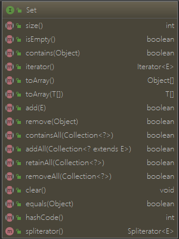

> HashSet 源码阅读

<!-- more -->

> 关于 Set，其实 HashSet 实际由 HashMap 实现,因而基本所有方法都是调用的HashMap中的方法，同理 TreeSet 由 TreeMap 实现

## Set

​                                               ===>                   


## AbstractSet

### equals

> 1. 判断内存地址是否一致
> 2. 判断是否为 Set 实例，若不是，返回false
> 3. 判断包含元素个数是否相同，若不同，返回false
> 4. 判断是否包含另一Set 所有元素(二者元素个数相同)，若是，返回true

```java
public boolean equals(Object o) {
    if (o == this)
        return true;

    if (!(o instanceof Set))
        return false;
    Collection<?> c = (Collection<?>) o;
    if (c.size() != size())
        return false;
    try {
        return containsAll(c);
    } catch (ClassCastException unused)   {
        return false;
    } catch (NullPointerException unused) {
        return false;
    }
}
```

### hashCode

> 所有元素哈希码求和

```java
public int hashCode() {
    int h = 0;
    Iterator<E> i = iterator();
    while (i.hasNext()) {
        E obj = i.next();
        if (obj != null)
            h += obj.hashCode();
    }
    return h;
}
```

### removeAll

> 删除交集

```java
public boolean removeAll(Collection<?> c) {
    Objects.requireNonNull(c);
    boolean modified = false;

    if (size() > c.size()) {
        for (Iterator<?> i = c.iterator(); i.hasNext(); )
            modified |= remove(i.next());
    } else {
        for (Iterator<?> i = iterator(); i.hasNext(); ) {
            if (c.contains(i.next())) {
                i.remove();
                modified = true;
            }
        }
    }
    return modified;
}
```

## HashSet


### 成员变量

```java
private transient HashMap<E,Object> map;// HashSet 其实是 value 固定为 PRESENT 的 HashMap
// Dummy value to associate with an Object in the backing Map
// 存放在 Map中的假值
private static final Object PRESENT = new Object(); 
```

## 构造函数

> 就是 HashMap

```java
public HashSet() {
    map = new HashMap<>();
}
public HashSet(Collection<? extends E> c) {
    map = new HashMap<>(Math.max((int) (c.size()/.75f) + 1, 16));
    addAll(c);
}
 public HashSet(int initialCapacity, float loadFactor) {
     map = new HashMap<>(initialCapacity, loadFactor);
 }
 public HashSet(int initialCapacity) {
     map = new HashMap<>(initialCapacity);
 }
HashSet(int initialCapacity, float loadFactor, boolean dummy) {
    map = new LinkedHashMap<>(initialCapacity, loadFactor);
}
```

## iterator

```java
public Iterator<E> iterator() {
    return map.keySet().iterator();
}
```

## size

```java
public int size() {
    return map.size();
}
```

## isEmpty

```java
public boolean isEmpty() {
    return map.isEmpty();
}
```

## contains

```java
public boolean contains(Object o) {
    return map.containsKey(o);
}
```

## add

```java
public boolean add(E e) {
    return map.put(e, PRESENT)==null;
}
```

## remove

```java
public boolean remove(Object o) {
    return map.remove(o)==PRESENT;
}
```

## clear

```java
public void clear() {
    map.clear();
}
```

##  clonel

```java
public Object clone() {
    try {
        HashSet<E> newSet = (HashSet<E>) super.clone();
        newSet.map = (HashMap<E, Object>) map.clone();
        return newSet;
    } catch (CloneNotSupportedException e) {
        throw new InternalError(e);
    }
}
```

