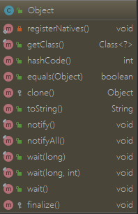

> Object 类源码阅读

<!-- more -->

Object类包含以下方法：



### 1. equal(Object) 

```java
public boolean equals(Object obj) {
        return (this == obj);
}
```

> 一般都需要重写该方法，否则最后调用的就是 == ，即比较两个数据的值是否相等
>
> + 在进行数据比较时，引用数据类型比较的是引用（内存地址），基本数据类型比较的值
> + equals()方法只可用来比较引用类型(基本重写过，用来比较类型及内容，而不是内存地址)， == 可以比较引用类型和基本类型，但是引用类型比较，常用的为和 null 比较，判断是否为空指针
> + == 比较时，符号两端的数据类型要求一致，否则会报错，部分支持自动装箱转型的除外。equals 只需两个数据都是引用类型即可

### 2. getClass()

```java
public final native Class<?> getClass()
```

> 调用的本地库，返回对象运行时的类，返回的类型为 Class 类，通过 Class 类实例对象，可以获取该类实例，每个成员变量都是Field实例；对象的所有成员方法，每个成员方法都是 Method 实例；构造函数同理

```java
String a = new String("HelloWorld");
Class<?>[] list = a.getClass().getInterfaces();
for(int i = 0; i < list.length;i++){
    System.out.println(list[i]);
}
```
```java
import java.lang.reflect.Type;
Type[] typeList = Class.forName("java.lang.String").getGenericInterfaces();
for(int i = 0; i < typeList.length;i++){
    System.out.println(typeList[i]);
}
```
```java
import java.lang.reflect.Field;
Field[]  fields = Class.forName("java.lang.String").getFields();
for(Field field : fields){
    System.out.println(field);
}
```
```java
import java.lang.reflect.Method;
Method[]  methods = Class.forName("java.lang.String").getMethods();
for(Method method : methods){
    System.out.println(method);
}
```
```java
import java.lang.reflect.Constructor;
Constructor[]  constructors = Class.forName("java.lang.String").getConstructors();
for(Constructor constructor : constructors){
    System.out.println(constructor);
}
```

### 3. clone() 

> 克隆后得到的对象，一般只有基本类型数据和原对象是独立的。即引用数据类型不独立，如果要完全独立复制，最好新建对象，然后逐个赋值。
> 如果一个类需要实现克隆操作，需要实现接口Cloneable，然后抛出CloneNotSupportedException异常
>
> ```java
> x.clone() != x // 大多情况下为true，但是不是绝对，看重写类方法情况
> x.clone().getClass() == x.getClass() // 原则上，这个绝对成立
> ```

```java
class TestClone implements Cloneable{
    public int testInt=3;
    public List<Integer> list = new ArrayList(){
        {
            add(2);
            add(3);
        }
    };
    @Override
    public TestClone clone() throws CloneNotSupportedException{
        return (TestClone)super.clone();
    }
    public static void main(){
        try{
            TestClone a = new TestClone();
            TestClone b = a.clone(); // 深复制，得到的对象和原来的是独立的 deep copy
            TestClone c = b; // 浅复制，只是复制了引用，shallow copy
            System.out.println("a:"+a.testInt + "\tb:"+b.testInt + "\tc:"+c.testInt);
            System.out.println("a.list:" + a.list + "\tb.list:" + b.list);
            System.out.println("Operation Set b.testInt = 5  b.list.add(5)");   
            b.testInt = 5;
            b.list.add(5);
            System.out.println("a:"+a.testInt + "\tb:"+b.testInt + "\tc:"+c.testInt);
            System.out.println("a.list:" + a.list + "\tb.list:" + b.list);
            System.out.println("Operation Set a.testInt = 1  b.list.remove(0)"); 
            a.testInt = 1;
            b.list.remove(0);
            System.out.println("a:"+a.testInt + "\tb:"+b.testInt + "\tc:"+c.testInt);
            System.out.println("a.list:" + a.list + "\tb.list:" + b.list);
        }catch (Exception e){
            e.printStackTrace();
        }
    }
}
```

输出结果：

```
a:3	b:3	c:3
a.list:[2, 3]	b.list:[2, 3]
Operation Set b.testInt = 5  b.list.add(5)
a:3	b:5	c:5
a.list:[2, 3, 5]	b.list:[2, 3, 5]
Operation Set a.testInt = 1  b.list.remove(0)
a:1	b:5	c:5
a.list:[3, 5]	b.list:[3, 5]
```

### 4. toString()

> 一般返回一个字符串，为了方便阅读，强烈建议每个子类都重写该方法；
> 在没有重写的情况下，返回的字符串组成为：**类名@对象的无符号十六进制哈希码**

```java
 public String toString() {
        return getClass().getName() + "@" + Integer.toHexString(hashCode());
 }
```

### 5. notify()

> 如果有线程处于等待状态，**随机唤醒**其中一个。被唤醒的线程不会里面开始执行，而是以正常方式和其他 其他线程竞争。线程只有在拥有监视器后才可以执行该方法，获得监视器的方式有如下三种：

By executing a synchronized instance method of that object.
By executing the body of a {@code synchronized} statementthat synchronizes on the object.
For objects of type {@code Class,} by executing asynchronized static method of that class.

即：

>  通过执行对象synchronized实例方法
> 通过执行在此对象上进行同步的 synchronized 语句的代码块。
> 对于 Class 类型的对象，可以通过执行该类的同步静态方法。

### 6. notifyAll()

和notify()类似，只是同时唤醒所有在等待中的线程

### 7. wait(long)

```java
public final native void wait(long timeout)
```

计数单位为纳秒，时长为：1000000*timeout 使当前线程处于等待状态，直到其他线程唤醒；或者等待一定的时长。
该方法只有在线程持有监视器的情况下才能条用。
三种异常：
IllegalArgumentException：参数timeout非法 IllegalMonitorStateException：在未持有监视器情况下调用（未加锁） InterruptedException：在等待状态中的线程被中断。

```java
public final void wait(long timeout, int nanos) throws InterruptedException {
        if (timeout < 0) {
            throw new IllegalArgumentException("timeout value is negative");
        }
        if (nanos < 0 || nanos > 999999) {
            throw new IllegalArgumentException(
                                "nanosecond timeout value out of range");
        }
        if (nanos > 0) {
            timeout++;
        }
        wait(timeout);
    }
```

和wait(long timeout)类似，计数单位为纳秒，时长（在nano>0时）为：1000000*timeout+1
总体而言，nanos这个参数被无视了。

### 8. finalize()

```java
 protected void finalize()
```

在确定对象没有被引用指向的时候调用，由垃圾回收器调用该方法

对 finalize() 方法 网上博客有结论：
>+  最重要的，尽量不要用finalize，太复杂了，还是让系统照管比较好。可以定义其它的方法来释放非内存资源。
>+  如果用，尽量简单。
>+  如果用，避免对象再生，这个是自己给自己找麻烦。
>+  可以用来保护非内存资源被释放。即使我们定义了其它的方法来释放非内存资源，但是其它人未必会调用该方法来释放。在finalize里面可以检查一下，如果没有释放就释放好了，晚释放总比不释放好。
>+  即使对象的finalize已经运行了，不能保证该对象被销毁。要实现一些保证对象彻底被销毁时的动作，只能依赖于java.lang.ref里面的类和GC交互。

### 9. hashCode()

> 按照一定的算法将对象转变成一个值
>
> + 如果两个对象相等，则hashCode() 结果必须相同
> + 如果两个对象的hashCode() 结果相同，则两个对象**不一定相等**
> +  Java 规范里面规定，一般是覆盖 equals() 方法应该连带覆盖 hashCode() 方法

###  10. registerNatives()

> 将C/C++中的方法映射到Java中的native方法，实现方法命名的解耦,在类加载和实例创建时会自动调用

```java
    private static native void registerNatives();
    static {
        registerNatives();
    }
```

