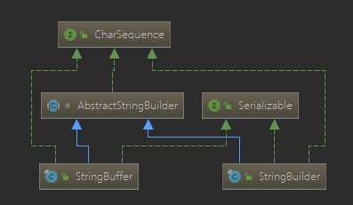
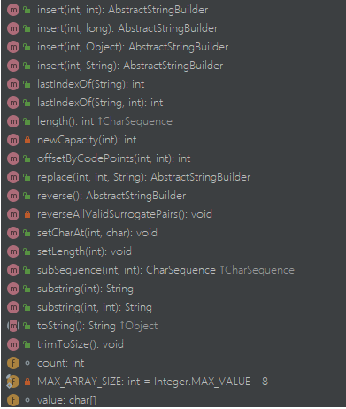

> StringBuilder源码阅读，StringBuffer和StringBuilder的差距只是方法上的synchronized

<!-- more -->

StringBuilder和StringBuffer都继承了 AbstractStringBuilder，且两个类都是final class，在实现上，两个类基本都是调用的 AbstractStringBuilder中的方法，所以阅读这两个类的源码，重点在AbstractStringBuilder类



AbstractStringBuilder包含方法：




```java
abstract class AbstractStringBuilder implements Appendable, CharSequence 
```
未写的方法，调用与String类似或者相同

Arrays.copyOf(value,newCapacity(minimumCapacity))：
新建一个长度为minimumCapacity数组，并将value值复制进去，返回新建的数组  
**该方法基本在改动数组/字符串之前都会调用**

```java
private void ensureCapacityInternal(int minimumCapacity) {
        // overflow-conscious code
        if (minimumCapacity - value.length > 0) {
            value = Arrays.copyOf(value,
                    newCapacity(minimumCapacity));
        }
    }
```

由于虚拟机要存放一些头部信息，所以，最大长度只能为Integer.MAX_VALUE - 8

     * The maximum size of array to allocate (unless necessary).
     * Some VMs reserve some header words in an array.
     * Attempts to allocate larger arrays may result in
     * OutOfMemoryError: Requested array size exceeds VM limit
     */
```java
private static final int MAX_ARRAY_SIZE = Integer.MAX_VALUE - 8;
```

数组长度（字符串存值用的是数组）必须小于Integer.MAX_VALUE但是可以大于MAX_ARRAY_SIZE
```java
 private int newCapacity(int minCapacity) {
        // overflow-conscious code
        int newCapacity = (value.length << 1) + 2;
        if (newCapacity - minCapacity < 0) {
            newCapacity = minCapacity;
        }
        return (newCapacity <= 0 || MAX_ARRAY_SIZE - newCapacity < 0)
            ? hugeCapacity(minCapacity)
            : newCapacity;
    }

    private int hugeCapacity(int minCapacity) {
        if (Integer.MAX_VALUE - minCapacity < 0) { // overflow
            throw new OutOfMemoryError();
        }
        return (minCapacity > MAX_ARRAY_SIZE)
            ? minCapacity : MAX_ARRAY_SIZE;
    }
```

只有在newLength>=原来的长度的时候，才会生效，并附加空字符串。
但是在newLength<原来的长度的时候，虽然值不会变化，但是长度会被设置成newLength
```java
 public void setLength(int newLength) {
        if (newLength < 0)
            throw new StringIndexOutOfBoundsException(newLength);
        ensureCapacityInternal(newLength);

        if (count < newLength) {
            Arrays.fill(value, count, newLength, '\0');
        }

        count = newLength;
    }
```

 ```java
 public void setCharAt(int index, char ch) {
        if ((index < 0) || (index >= count))
            throw new StringIndexOutOfBoundsException(index);
        value[index] = ch;
    }
 ```

```java
public AbstractStringBuilder append(boolean b) {
        if (b) {
            ensureCapacityInternal(count + 4);
            value[count++] = 't';
            value[count++] = 'r';
            value[count++] = 'u';
            value[count++] = 'e';
        } else {
            ensureCapacityInternal(count + 5);
            value[count++] = 'f';
            value[count++] = 'a';
            value[count++] = 'l';
            value[count++] = 's';
            value[count++] = 'e';
        }
        return this;
    }
 private AbstractStringBuilder appendNull() {
        int c = count;
        ensureCapacityInternal(c + 4);
        final char[] value = this.value;
        value[c++] = 'n';
        value[c++] = 'u';
        value[c++] = 'l';
        value[c++] = 'l';
        count = c;
        return this;
    }
```

追加整数的时候，需要考虑整数大小、正负（正负数占空间大小不同）。  

public AbstractStringBuilder append(long l)实现类似。 
```java
 public AbstractStringBuilder append(int i) {
        if (i == Integer.MIN_VALUE) {
            append("-2147483648");
            return this;
        }
        int appendedLength = (i < 0) ? Integer.stringSize(-i) + 1
                                     : Integer.stringSize(i);
        int spaceNeeded = count + appendedLength;
        ensureCapacityInternal(spaceNeeded);
        Integer.getChars(i, spaceNeeded, value);
        count = spaceNeeded;
        return this;
    }
```

 AbstractStringBuilder append(float f)  调用的 FloatingDecimal.appendTo(f,this);  

 AbstractStringBuilder append(double d) 调用的FloatingDecimal.appendTo(d,this);

尾部count-end长度的内存内容没有删除。但是无法访问到。
```java
 public AbstractStringBuilder delete(int start, int end) {
        if (start < 0)
            throw new StringIndexOutOfBoundsException(start);
        if (end > count)
            end = count;
        if (start > end)
            throw new StringIndexOutOfBoundsException();
        int len = end - start;
        if (len > 0) {
            System.arraycopy(value, start+len, value, start, count-end);
            count -= len;
        }
        return this;
    }
 public AbstractStringBuilder deleteCharAt(int index) {
        if ((index < 0) || (index >= count))
            throw new StringIndexOutOfBoundsException(index);
        System.arraycopy(value, index+1, value, index, count-index-1);
        count--;
        return this;
    }
```

```java
public AbstractStringBuilder replace(int start, int end, String str) {
        if (start < 0)
            throw new StringIndexOutOfBoundsException(start);
        if (start > count)
            throw new StringIndexOutOfBoundsException("start > length()");
        if (start > end)
            throw new StringIndexOutOfBoundsException("start > end");

        if (end > count)
            end = count;
        int len = str.length();
        int newCount = count + len - (end - start);
    //先将长度扩充或者减少
        ensureCapacityInternal(newCount);
    //将需要替换的长度空闲出来，然后将会被影响到的需要保留的部分，移动到替换区域后方
        System.arraycopy(value, end, value, start + len, count - end);
    // 将srt追加到value[start-1]后面
        str.getChars(value, start);
        count = newCount;
        return this;
    }
public AbstractStringBuilder insert(int offset, String str) {
        if ((offset < 0) || (offset > length()))
            throw new StringIndexOutOfBoundsException(offset);
        if (str == null)
            str = "null";
        int len = str.length();
        ensureCapacityInternal(count + len);
        System.arraycopy(value, offset, value, offset + len, count - offset);
        str.getChars(value, offset);
        count += len;
        return this;
    }
```
```java
public AbstractStringBuilder insert(int index, char[] str, int offset,
                                        int len)
    {
        if ((index < 0) || (index > length()))
            throw new StringIndexOutOfBoundsException(index);
        if ((offset < 0) || (len < 0) || (offset > str.length - len))
            throw new StringIndexOutOfBoundsException(
                "offset " + offset + ", len " + len + ", str.length "
                + str.length);
    //原理与replace类似，相当于原来的字符串为空
        ensureCapacityInternal(count + len);
    //将index后的字符都往后移
        System.arraycopy(value, index, value, index + len, count - index);
    //将字符串需要插入部分的插入到index后
        System.arraycopy(str, offset, value, index, len);
        count += len;
        return this;
    }
```

**substring**方法最终调用的是String类中的方法new String(value, start, end - start)，  

String类中调用的是this.value = Arrays.copyOfRange(value, offset, offset+count)  

copyOfRanged中调用的是System.arraycopy(original, from, copy, 0,
                         Math.min(original.length - from, newLength));

字符串翻转
```java
 public AbstractStringBuilder reverse() {
        boolean hasSurrogates = false;
     //在长度为奇数、偶数情况下都是这个规律
        int n = count - 1;
        for (int j = (n-1) >> 1; j >= 0; j--) {
            int k = n - j;
            char cj = value[j];
            char ck = value[k];
            value[j] = ck;
            value[k] = cj;
            if (Character.isSurrogate(cj) ||
                Character.isSurrogate(ck)) {
                hasSurrogates = true;
            }
        }
        if (hasSurrogates) {
            //如果存在高位编码，翻转时，两位一翻转
            reverseAllValidSurrogatePairs();
        }
        return this;
    }

    /** Outlined helper method for reverse() */
    private void reverseAllValidSurrogatePairs() {
        for (int i = 0; i < count - 1; i++) {
            char c2 = value[i];
            //由于16bit组成一个整体，故而倒转的时候，应是每两个组成一个，
            //故而需要奇偶互换位置
            if (Character.isLowSurrogate(c2)) {
                char c1 = value[i + 1];
                if (Character.isHighSurrogate(c1)) {
                    value[i++] = c1;
                    value[i] = c2;
                }
            }
        }
    }
```


```java
public final class StringBuffer
    extends AbstractStringBuilder
    implements java.io.Serializable, CharSequence
    
public final class StringBuilder
    extends AbstractStringBuilder
    implements java.io.Serializable, CharSequence
```

StringBuffer几乎所有的方法都是调用的AbstractStringBuilder的方法，但是各方法都用synchronized修饰。 同时添加变量

```java
 private transient char[] toStringCache;
```

用于保存toString的内容。添加transient效果可以使得该变量不被序列化，能够节省空间。因为该内容可以通过对象生成，并且实时刷新。

序列化和反序列化时才能用到(writeObject方法在StringBuilder中的实现，只差一个synchronized)：

```java
 /**
     * Serializable fields for StringBuffer.
     *
     * @serialField value  char[]
     *              The backing character array of this StringBuffer.
     * @serialField count int
     *              The number of characters in this StringBuffer.
     * @serialField shared  boolean
     *              A flag indicating whether the backing array is shared.
     *              The value is ignored upon deserialization.
     */
    private static final java.io.ObjectStreamField[] serialPersistentFields =
    {
        new java.io.ObjectStreamField("value", char[].class),
        new java.io.ObjectStreamField("count", Integer.TYPE),
        new java.io.ObjectStreamField("shared", Boolean.TYPE),
    };

    /**
     * readObject is called to restore the state of the StringBuffer from
     * a stream.
     */
    private synchronized void writeObject(java.io.ObjectOutputStream s)
        throws java.io.IOException {
        java.io.ObjectOutputStream.PutField fields = s.putFields();
        fields.put("value", value);
        fields.put("count", count);
        fields.put("shared", false);
        s.writeFields();
    }

    /**
     * readObject is called to restore the state of the StringBuffer from
     * a stream.
     */
    private void readObject(java.io.ObjectInputStream s)
        throws java.io.IOException, ClassNotFoundException {
        java.io.ObjectInputStream.GetField fields = s.readFields();
        value = (char[])fields.get("value", null);
        count = fields.get("count", 0);
    }
```