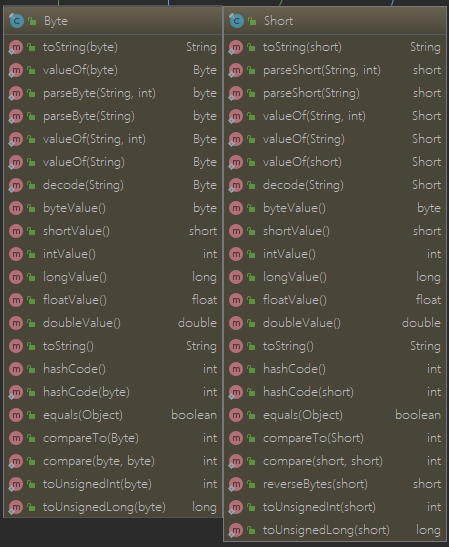
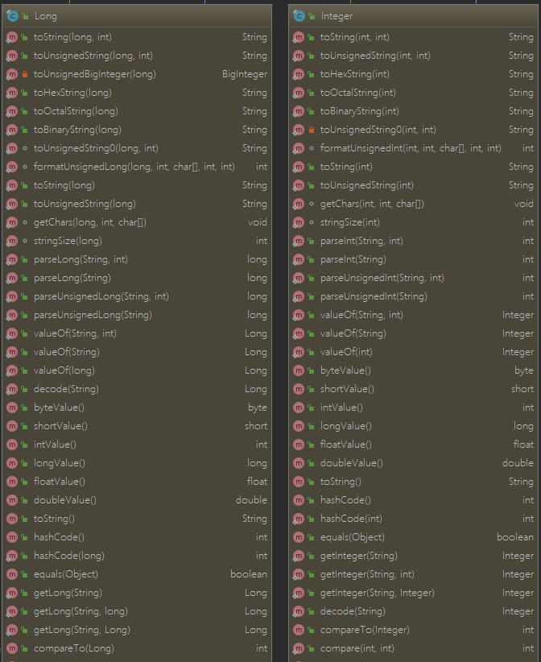
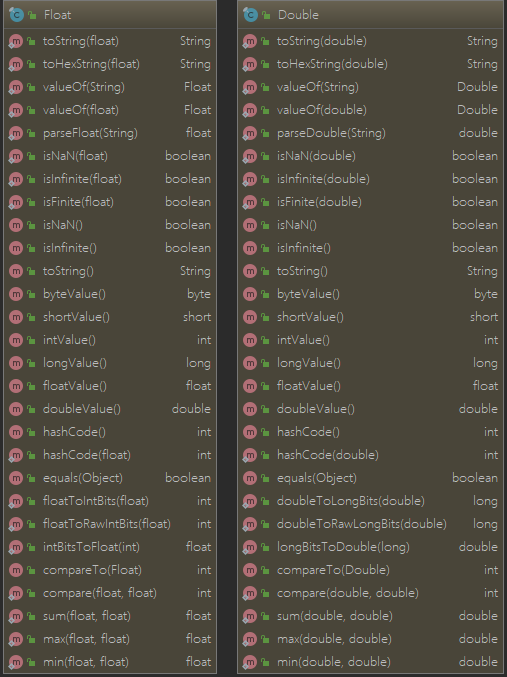
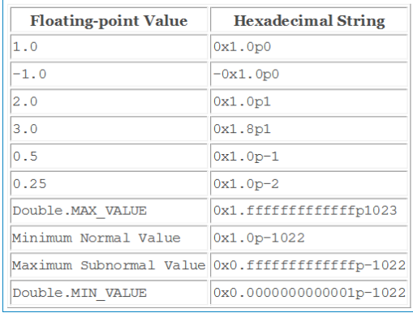

> Character Boolean Byte Short Integer Long Float Double Void

<!-- more -->

| 基础类型 | 大小(字节) |    默认值    |  封装类   |
| :------: | :--------: | :----------: | :-------: |
|   byte   |     1      |   (byte)0    |   Byre    |
|  short   |     2      |   (short)0   |   Short   |
|   int    |     4      |      0       |  Integer  |
|   long   |     8      |      0L      |   Long    |
|  float   |     4      |     0.0f     |   Float   |
|  double  |     8      |     0.0d     |  Double   |
| boolean  |     -      |    false     |  Boolean  |
|   char   |     2      | \u0000(null) | Character |
|   void   |     -      |      -       |   Void    |

> boolean类型占了单独使用是4个字节，在数组中又是1个字节;
> **原因**：**单个的boolean** 类型变量在编译的时候是**使用的int 类型**。而对于boolean 类型的数组时，在编译的时候是作为byte array来编译的所以boolean 数组里面的每一个元件占一个字节

>  [参考链接](https://www.cnblogs.com/alternative/p/7520332.html)
>
>  1. Java中的数值都是有符号的，不存在无符号的数，它们的取值范围也是固定的，不会随着硬件环境或者操作系统的改变而改变。
>  2. 原始数据类型在传递参数时都是按值传递，封装类都是按引用传递。
>  3. Java语言中，默认声明的小数是double类型的，因此对float类型的变量进行初始化时需要进行类型转换。float类型变量有两种初始化方法：float f = 1.0f  或者 float f =(float) 1.0 。
>  4. "=="和"equals（）"方法：
>
>  　　　　1）基本型和基本型封装型进行“==”运算符的比较，基本型封装型将会自动拆箱变为基本型后再进行比较，因此Integer(0)会自动拆箱为int类型再进行比较，显然返回true。
>  　　　　2）两个Integer类型进行“==”比较，如果其值在-128至127，那么返回true，否则返回false, 这跟Integer.valueOf()的缓冲对象有关.
>  　　　　3）两个基本型的封装型进行equals()比较，首先equals()会比较类型，如果类型相同，则继续比较值，如果值也相同，返回true。
>  　　　　4）基本型封装类型调用equals(),但是参数是基本类型，这时候，先会进行自动装箱，基本型转换为其封装类型，再进行3）中的比较。

## 1. Boolean

```java
public final class Boolean implements java.io.Serializable,
                                      Comparable<Boolean>
	// 表明这个类的对象为原始数据类型 boolean，推测是用于自动拆箱
	public static final Class<Boolean> TYPE = (Class<Boolean>) Class.getPrimitiveClass("boolean");
	// 除了 true 字符串，都返回false
	public static boolean parseBoolean(String s) {
        return ((s != null) && s.equalsIgnoreCase("true"));
    }
    public static Boolean valueOf(String s) {
        return parseBoolean(s) ? TRUE : FALSE;
    }
    // 为 Boolean 实例比较值，否则返回false
	public boolean equals(Object obj) {
        if (obj instanceof Boolean) {
            return value == ((Boolean)obj).booleanValue();
        }
        return false;
    }
    // 只有字符串为 "true" 时返回true
 	public static boolean getBoolean(String name) {
        boolean result = false;
        try {
            result = parseBoolean(System.getProperty(name));
        } catch (IllegalArgumentException | NullPointerException e) {
        }
        return result;
    }
    public static String toString(boolean b) {
        return b ? "true" : "false";
    }
    public String toString() {
        return value ? "true" : "false";
    }
    //1231 代表true， 1237代表false
    public static int hashCode(boolean value) {
        return value ? 1231 : 1237;
    }
 
    public static int compare(boolean x, boolean y) {
        return (x == y) ? 0 : (x ? 1 : -1);
    }
    // 逻辑与
    public static boolean logicalAnd(boolean a, boolean b) {
        return a && b;
    }
	// 逻辑或
    public static boolean logicalOr(boolean a, boolean b) {
        return a || b;
    }
	// 逻辑异或
    public static boolean logicalXor(boolean a, boolean b) {
        return a ^ b;
    }
```

## 2. Byte

> byte 表示的最大值为 127 即 $2^7$-1，最小值为 -128 即 $-2^{7}$

```java
public static final byte   MIN_VALUE = -128;
public static final byte   MAX_VALUE = 127;
```

> 静态内部类，用于缓存范围内的值

```java
private static class ByteCache {
    private ByteCache(){}

    static final Byte cache[] = new Byte[-(-128) + 127 + 1];

    static {
        for(int i = 0; i < cache.length; i++)
            cache[i] = new Byte((byte)(i - 128));
    }
}
```

> 通过 ByteCache 获取值来进行类型转换

```java
public static Byte valueOf(byte b) {
        final int offset = 128;
        return ByteCache.cache[(int)b + offset];
    }
```

> 根据进制将字符串转换为 int 类型，如果值在表示范围内，则返回；否则抛出 NumberFormatException 异常

```java
 public static byte parseByte(String s, int radix)
        throws NumberFormatException {
        int i = Integer.parseInt(s, radix);
        if (i < MIN_VALUE || i > MAX_VALUE)
            throw new NumberFormatException(
                "Value out of range. Value:\"" + s + "\" Radix:" + radix);
        return (byte)i;
    }
// 默认是 10 进制
public static byte parseByte(String s) throws NumberFormatException {
        return parseByte(s, 10);
    }
public Byte(String s) throws NumberFormatException {
        this.value = parseByte(s, 10);
    }
public byte byteValue() {
        return value;
    }
```

> 将字符串转换为 Byte 对象，最终调用的其实是 parseByte

```java
public static Byte valueOf(String s, int radix)
        throws NumberFormatException {
        return valueOf(parseByte(s, radix));
    }
 public static Byte valueOf(String s) throws NumberFormatException {
        return valueOf(s, 10);
    }
```

> 解码，先调用的 Integer 解码方法，详情见 Integer 类
>
> 可解码的字符串，只能为十进制、十六进制、八进制

```java
public static Byte decode(String nm) throws NumberFormatException {
        int i = Integer.decode(nm);
        if (i < MIN_VALUE || i > MAX_VALUE)
            throw new NumberFormatException(
                    "Value " + i + " out of range from input " + nm);
        return valueOf((byte)i);
    }
```

> 数据类型转换

```java
 	public byte byteValue() {
        return value;
    }
    public short shortValue() {
        return (short)value;
    }
    public int intValue() {
        return (int)value;
    }
    public long longValue() {
        return (long)value;
    }
    public float floatValue() {
        return (float)value;
    }
    public double doubleValue() {
        return (double)value;
    }
```

> byte 转字符串，调用的Integer的方法

```java
public String toString() {
    return Integer.toString((int)value);
}
```

> hashCode， byte的hashcode就是本身的值

```java
 public int hashCode() {
        return Byte.hashCode(value);
 }
 public static int hashCode(byte value) {
        return (int)value;
 }
```

> 比较

```java
 public static int compare(byte x, byte y) {
        return x - y;
 }
 public int compareTo(Byte anotherByte) {
        return compare(this.value, anotherByte.value);
 }
```

> 转型

```java
public static int toUnsignedInt(byte x) {
        return ((int) x) & 0xff; // 转换为int，32位长度，仅保留8位有值部分
}
public static long toUnsignedLong(byte x) {
        return ((long) x) & 0xffL;
}
```

> 内存占用大小

```java
public static final int SIZE = 8;
public static final int BYTES = SIZE / Byte.SIZE;
```

## 3. Short

> short类型范围  -32768 ~ 32767 即：-$2^{15}​$~$2^{15}-1​$

```java
public static final short   MIN_VALUE = -32768;
public static final short   MAX_VALUE = 32767;
```



> 余下代码原理基本和Byte中的转换一致，只是 Short 类型值域范围更大
> 同时，需要注意的是，Short 类型的值，在 -128~127 之间的值使用的是 ShortCache 静态内部类，与 Byte 类似，即 -128~127之间的值，指向的常量池同一个地方。

```java
    private static class ShortCache {
        private ShortCache(){}

        static final Short cache[] = new Short[-(-128) + 127 + 1];

        static {
            for(int i = 0; i < cache.length; i++)
                cache[i] = new Short((short)(i - 128));
        }
    }

    public static Short valueOf(short s) {
        final int offset = 128;
        int sAsInt = s;
        if (sAsInt >= -128 && sAsInt <= 127) { // must cache
            return ShortCache.cache[sAsInt + offset];
        }
        return new Short(s);
    }

    public static final int SIZE = 16;

    public static final int BYTES = SIZE / Byte.SIZE;
	// 这里的倒转，以字节为单位倒转交换位置
    public static short reverseBytes(short i) {
        return (short) (((i & 0xFF00) >> 8) | (i << 8));
    }

    public static int toUnsignedInt(short x) {
        return ((int) x) & 0xffff;
    }
    public static long toUnsignedLong(short x) {
        return ((long) x) & 0xffffL;
    }
```

## 4. Integer、Long

> 值范围 -$2^{31}$~$2^{31}-1$； 同样，Integer 和 Long也有 对应的缓存内部类 IntegerCache 和 LongCache 用于存储 -128 ~ 127 的数值

```java
 @Native public static final int   MIN_VALUE = 0x80000000;
 @Native public static final int   MAX_VALUE = 0x7fffffff;
```

> Integer 使用常量数组提供 字符串数字的可能字符

```java
 final static char[] digits = {
        '0' , '1' , '2' , '3' , '4' , '5' ,
        '6' , '7' , '8' , '9' , 'a' , 'b' ,
        'c' , 'd' , 'e' , 'f' , 'g' , 'h' ,
        'i' , 'j' , 'k' , 'l' , 'm' , 'n' ,
        'o' , 'p' , 'q' , 'r' , 's' , 't' ,
        'u' , 'v' , 'w' , 'x' , 'y' , 'z'
    };
 final static char [] DigitTens = {
        '0', '0', '0', '0', '0', '0', '0', '0', '0', '0',
        '1', '1', '1', '1', '1', '1', '1', '1', '1', '1',
        '2', '2', '2', '2', '2', '2', '2', '2', '2', '2',
        '3', '3', '3', '3', '3', '3', '3', '3', '3', '3',
        '4', '4', '4', '4', '4', '4', '4', '4', '4', '4',
        '5', '5', '5', '5', '5', '5', '5', '5', '5', '5',
        '6', '6', '6', '6', '6', '6', '6', '6', '6', '6',
        '7', '7', '7', '7', '7', '7', '7', '7', '7', '7',
        '8', '8', '8', '8', '8', '8', '8', '8', '8', '8',
        '9', '9', '9', '9', '9', '9', '9', '9', '9', '9',
        } ;

    final static char [] DigitOnes = {
        '0', '1', '2', '3', '4', '5', '6', '7', '8', '9',
        '0', '1', '2', '3', '4', '5', '6', '7', '8', '9',
        '0', '1', '2', '3', '4', '5', '6', '7', '8', '9',
        '0', '1', '2', '3', '4', '5', '6', '7', '8', '9',
        '0', '1', '2', '3', '4', '5', '6', '7', '8', '9',
        '0', '1', '2', '3', '4', '5', '6', '7', '8', '9',
        '0', '1', '2', '3', '4', '5', '6', '7', '8', '9',
        '0', '1', '2', '3', '4', '5', '6', '7', '8', '9',
        '0', '1', '2', '3', '4', '5', '6', '7', '8', '9',
        '0', '1', '2', '3', '4', '5', '6', '7', '8', '9',
        } ;
```

> 将已有数值转换成不同进制的字符串形式

```java
public static String toString(int i, int radix) {
    // Character.MIN_RADIX 值为2， Character.MAX_RADIX 值为36
        if (radix < Character.MIN_RADIX || radix > Character.MAX_RADIX)
            radix = 10;

        /* Use the faster version */
        if (radix == 10) {
            return toString(i);
        }

        char buf[] = new char[33];
        boolean negative = (i < 0);
        int charPos = 32;

        if (!negative) {// 先将数值都转换为正数来对待
            i = -i;
        }

        while (i <= -radix) {//从后往前进行计算并记录值
            buf[charPos--] = digits[-(i % radix)];
            i = i / radix;
        }
        buf[charPos] = digits[-i];

        if (negative) {// 如果是负数，添加负号
            buf[--charPos] = '-';
        }

        return new String(buf, charPos, (33 - charPos));
    }
 public static String toString(int i) {
        if (i == Integer.MIN_VALUE)
            return "-2147483648";
        int size = (i < 0) ? stringSize(-i) + 1 : stringSize(i);
        char[] buf = new char[size];
        getChars(i, size, buf);
        return new String(buf, true);
    }
```

### getChars(int i, int index, char[] buf)

> 专门用于10进制转换的，
> 大于 65536 时，每次转换两位，使用 4 + 32 + 64 =100来拆分成位运算
> 小于 65536 时，每次转换1位，使用 2 + 8 = 10来拆分成位运算

```java
static void getChars(int i, int index, char[] buf) {
        int q, r;
        int charPos = index;
        char sign = 0;

        if (i < 0) {
            sign = '-';
            i = -i;
        }
        // Generate two digits per iteration
        while (i >= 65536) {
            q = i / 100;
        // really: r = i - (q * 100);
            r = i - ((q << 6) + (q << 5) + (q << 2));
            i = q;
            buf [--charPos] = DigitOnes[r];
            buf [--charPos] = DigitTens[r];
        }

        // Fall thru to fast mode for smaller numbers
        // assert(i <= 65536, i);
        for (;;) {//2+8 =10, 小一些的数字用 10 转换
            q = (i * 52429) >>> (16+3);
            r = i - ((q << 3) + (q << 1));  // r = i-(q*10) ...
            buf [--charPos] = digits [r];
            i = q;
            if (i == 0) break;
        }
        if (sign != 0) {
            buf [--charPos] = sign;
        }
    }
```

### stringSize(int)

> 输入值必须是 正数,在进行10进制转换的时候，可以快速确定转换数组的长度

```java
final static int [] sizeTable = { 9, 99, 999, 9999, 99999, 999999, 9999999,
                                      99999999, 999999999, Integer.MAX_VALUE };
    // Requires positive x
    static int stringSize(int x) {
        for (int i=0; ; i++)
            if (x <= sizeTable[i])
                return i+1;
    }
```


> 相比 Short，Integer类多了如下方法

### parseUnsignedInt(String ,int)
> 最终调用的 parseInt 和 Long.parseLong ，在执行之前排除有负号的数字，然后判断字符串长度，根据长度进行转换值的类型
>
> ```java
> if (len <= 5 || // Integer.MAX_VALUE in Character.MAX_RADIX is 6 digits
>     (radix == 10 && len <= 9) ) { // Integer.MAX_VALUE in base 10 is 10 digits
>     return parseInt(s, radix); 
> ```
>
> ```java
> long ell = Long.parseLong(s, radix);
> if ((ell & 0xffff_ffff_0000_0000L) == 0) { // 如果不为0，怎说明超过32位，抛出 NumberFormatException 异常
>     return (int) ell;
> }
> ```

### toUnsignedString(int,int) 

>  调用的Long中方法，Long 中部分处理方法使用的 BigInteger

```java
public static String toUnsignedString(int i, int radix) {
        return Long.toUnsignedString(toUnsignedLong(i), radix);
}
  public static String toUnsignedString(long i, int radix) {
        if (i >= 0)
            return toString(i, radix);
        else {
            switch (radix) {
            case 2:
                return toBinaryString(i);

            case 4:
                return toUnsignedString0(i, 2);

            case 8:
                return toOctalString(i);

            case 10:
                /*
                 * We can get the effect of an unsigned division by 10
                 * on a long value by first shifting right, yielding a
                 * positive value, and then dividing by 5.  This
                 * allows the last digit and preceding digits to be
                 * isolated more quickly than by an initial conversion
                 * to BigInteger.
                 */
                long quot = (i >>> 1) / 5;
                long rem = i - quot * 10;
                return toString(quot) + rem;

            case 16:
                return toHexString(i);

            case 32:
                return toUnsignedString0(i, 5);

            default:
                return toUnsignedBigInteger(i).toString(radix);
            }
        }
    }
```

###  getInteger(String nm, Integer val)

> 用于获取系统属性数值，目前没用到过

### decode(String nm)

> 将String 转换为Integer
> 因为平时表示有 8，10，16进制，其中8,16分别使用 0, 0x或# 开头，该函数用于判别不同的进制和正负，以便正确转换值

```java
 public static Integer decode(String nm) throws NumberFormatException {
        int radix = 10;
        int index = 0;
        boolean negative = false;
        Integer result;

        if (nm.length() == 0)
            throw new NumberFormatException("Zero length string");
        char firstChar = nm.charAt(0);
        // Handle sign, if present
        if (firstChar == '-') {
            negative = true;
            index++;
        } else if (firstChar == '+')
            index++;

        // Handle radix specifier, if present
        if (nm.startsWith("0x", index) || nm.startsWith("0X", index)) {
            index += 2;
            radix = 16;
        }
        else if (nm.startsWith("#", index)) {
            index ++;
            radix = 16;
        }
        else if (nm.startsWith("0", index) && nm.length() > 1 + index) {
            index ++;
            radix = 8;
        }

        if (nm.startsWith("-", index) || nm.startsWith("+", index))
            throw new NumberFormatException("Sign character in wrong position");

        try {
            result = Integer.valueOf(nm.substring(index), radix);
            result = negative ? Integer.valueOf(-result.intValue()) : result;
        } catch (NumberFormatException e) {
            // If number is Integer.MIN_VALUE, we'll end up here. The next line
            // handles this case, and causes any genuine format error to be
            // rethrown.
            String constant = negative ? ("-" + nm.substring(index))
                                       : nm.substring(index);
            result = Integer.valueOf(constant, radix);
        }
        return result;
    }
```

### formatUnsignedInt(int, int, char[], int, int )

> toHexString(int), toOctalString(int), toBinaryString(int) 的最终底层调用都是这个

```java
static int formatUnsignedInt(int val, int shift, char[] buf, int offset, int len) {
        int charPos = len;
        int radix = 1 << shift;//确定进制
        int mask = radix - 1; // 掩码，用于取值，如16进制掩码为 1111，每四位取一次值
        do {
            // 根据进制 取一定位数保存，使用 digits 中按表使用char替换
            buf[offset + --charPos] = Integer.digits[val & mask];
            val >>>= shift;//将已取的位去除
        } while (val != 0 && charPos > 0);

        return charPos;
}
 private static String toUnsignedString0(int val, int shift) {
        // assert shift > 0 && shift <=5 : "Illegal shift value";
        int mag = Integer.SIZE - Integer.numberOfLeadingZeros(val);// 得出有效值二进制位数
        int chars = Math.max(((mag + (shift - 1)) / shift), 1);// 求出转换所需的数组长度
        char[] buf = new char[chars];
        formatUnsignedInt(val, shift, buf, 0, chars);
        // Use special constructor which takes over "buf".
        return new String(buf, true);
 }
public static String toHexString(int i) {
        return toUnsignedString0(i, 4);
}
 public static String toOctalString(int i) {
        return toUnsignedString0(i, 3);
 }
 public static String toBinaryString(int i) {
        return toUnsignedString0(i, 1);
 }
```

> compareUnsigned(int,int)、dividedUnsigned(int,int)、remainderUnsigned(int,int)
> 如函数字面意思

### HighestOneBit(int)、lowestOneBit(int)

> HighestOneBit : 取 i 这个数的二进制形式最左边的最高一位且高位后面全部补零，最后返回int型的结果
> lowesetOneBit : 传入一个int参数i，返回其二进制最低位1的权值,

```java
public static int highestOneBit(int i) {
        // HD, Figure 3-1
        i |= (i >>  1);
        i |= (i >>  2);
        i |= (i >>  4);
        i |= (i >>  8);
        i |= (i >> 16);
        return i - (i >>> 1);
    }
public static int lowestOneBit(int i) {//原理与负数的补码表示有关，由i按位取反再末位加1可以得到-i的补码。
        // HD, Section 2-1
        return i & -i;
    }
```

### numberOfLeadingZeros(int)、numberOfTrailingZeros(int)

> 用户获取数值作为二进制时，头部和尾部连续的0的个数

```java
public static int numberOfLeadingZeros(int i) {
        if (i == 0)
            return 32;
        int n = 1;
    // 二分，判断最高的 16 位是否有值，如果不等于0，说明有值的位数 至少为 16位
        if (i >>> 16 == 0) { n += 16; i <<= 16; }
    // 判断最高 8 位是否有值，如果不等于0，则说明，至少有 16 + 8 位属于有效位数
        if (i >>> 24 == 0) { n +=  8; i <<=  8; }
    // 4 位
        if (i >>> 28 == 0) { n +=  4; i <<=  4; }
    // 2 位
        if (i >>> 30 == 0) { n +=  2; i <<=  2; }
    // 1 位
        n -= i >>> 31;
        return n;
}
public static int numberOfTrailingZeros(int i) {// 原理和numberOfLeadingZeros一样，反过来而已
        int y;
        if (i == 0) return 32;
        int n = 31;
        y = i <<16; if (y != 0) { n = n -16; i = y; }
        y = i << 8; if (y != 0) { n = n - 8; i = y; }
        y = i << 4; if (y != 0) { n = n - 4; i = y; }
        y = i << 2; if (y != 0) { n = n - 2; i = y; }
        return n - ((i << 1) >>> 31);
}
```

### bitCount(int)

> 返回 i 用二进制表示时 1 的个数
>
> 举例：
> 10110100 >>> 1 = 01011010
> 01011010& 01010101 = 01010000
> 10110100 - 01010000 =  01 10 01 00 //分别对应了两位一组中 1- 2- 1- 0 个1
> 接下来 4 位一组，01 + 10 = 11  01 + 00 = 01 即这8位数分成2组，即为 0011 0001
> 然后 8 位一组 0011 + 0001 = 0100 余下以此类推

```java
public static int bitCount(int i) { // 有点像 归并和位移的结合
        // HD, Figure 5-2
        i = i - ((i >>> 1) & 0x55555555); // 5 用二进制表示为 0101，2位一组，分别记录1的个数
        i = (i & 0x33333333) + ((i >>> 2) & 0x33333333);// 3 用二进制表示为 0011，4位一组
        i = (i + (i >>> 4)) & 0x0f0f0f0f; // 8 位一组， 0000 1111
        i = i + (i >>> 8); // 16位一组，int只有32位，16位一组，其实这里正好统计完成
        i = i + (i >>> 16); // 32位一组
        return i & 0x3f; // 最高肯定不会超过32，去最后 6 位
    }
```

### rotateLeft(int,int)、rotateRight(int,int)

> 循环左右，循环右移   微机原理简单概念，不解释

```java
public static int rotateLeft(int i, int distance) {
        return (i << distance) | (i >>> -distance); // 这里的 -distance 应该是 32 - distance，这样写会自动根据长度转换
}
public static int rotateRight(int i, int distance) {
        return (i >>> distance) | (i << -distance);
}
```

### reverse(int)

> 二进制数倒转
>
> 举个例子(依旧只写8位): 
> 11 01 00 10 => 11 10 00 01 => 10 11 01 00 => 01 00 10 11

```java
 public static int reverse(int i) {        
        i = (i & 0x55555555) << 1 | (i >>> 1) & 0x55555555; // 2位一组，互相交换位置
        i = (i & 0x33333333) << 2 | (i >>> 2) & 0x33333333; // 4位一组，互相交换位置
        i = (i & 0x0f0f0f0f) << 4 | (i >>> 4) & 0x0f0f0f0f; // 8位一组，互相交换位置
        i = (i << 24) | ((i & 0xff00) << 8) |
            ((i >>> 8) & 0xff00) | (i >>> 24);  //  16 位一组，互相交换位置
        return i;
 }
```

### signum(int)

> 常用的 sign 函数，这里是大于0返回1，等于 0则返回0， 小于 0 则返回 -1
>
> 负数转二进制：取负数绝对值的原码==>计算原码的反码==>对反码 + 1
>
> 还需了解 有符号数和无符号数位移的区别，以16位 +1 和 -1 为例：
> +1 ： 0000 0000 0000 0001
>  -1 ： 1111 1111 1111 1111 = $-1*2^{15} + 2^{14} + 2^{13}+......+ 2^0$
> 位移后：
> +1 >> 15 = 0   +1>>> 15 = 0
> -1 >> 15 = 1111 1111 1111 1111（符号不变，每次将符号也位移了）  
>  -1 >>> 15 = 0000 0000 0000 0001

```java
public static int signum(int i) {    
        return (i >> 31) | (-i >>> 31);
    }
```

> 这三个，字面意思理解就行，sum(int,int) 、max(int,int) 、min(int,int)

### Long 与 Integer

> Long 和 Integer 相比，只是值范围的不同，或者说长度不同，其原理操作等其实是一致的
>
> 其中 toUnsignedBigInteger(long)相对有所不同



## 5. Float、Double

>  Float 与 Double 的区别，类似于 Integer 和 Long
>
> 

> 先看一些常量的定义，Float 和 Double 引入了无穷大和无穷小，乍一看肯定在想，为什么 0 当除数会不报错，只有一个可能，就是Java中带小数的 零 是假零，实际上是大于0的极小的一个值。

```java
public static final double POSITIVE_INFINITY = 1.0 / 0.0;
public static final double NEGATIVE_INFINITY = -1.0 / 0.0;
public static final double NaN = 0.0d / 0.0;
public static final double MAX_VALUE = 0x1.fffffffffffffP+1023; // 1.7976931348623157e+308
public static final double MIN_NORMAL = 0x1.0p-1022; // 2.2250738585072014E-308
public static final double MIN_VALUE = 0x0.0000000000001P-1022; // 4.9e-324
public static final int MAX_EXPONENT = 1023;
public static final int MIN_EXPONENT = -1022;
```

```java
public static final float POSITIVE_INFINITY = 1.0f / 0.0f;
public static final float NEGATIVE_INFINITY = -1.0f / 0.0f;
public static final float NaN = 0.0f / 0.0f;
public static final float MAX_VALUE = 0x1.fffffeP+127f; // 3.4028235e+38f
public static final float MIN_NORMAL = 0x1.0p-126f; // 1.17549435E-38f
public static final float MIN_VALUE = 0x0.000002P-126f; // 1.4e-45f
public static final int MAX_EXPONENT = 127;
public static final int MIN_EXPONENT = -126;
```

> 具体方法函数，Float 和 Double 原理基本一致，在许多方法中 Float 直接使用的 Double中的方法
> toString 方法中， Float 和 Double 使用的是 FloatingDecimal.toJavaFormatString(double d)

### toString()

```java
public static String toString(double d) {
        return FloatingDecimal.toJavaFormatString(d);// 待研究
}
```

### doubleToLongBits(double value)

> 根据 IEEE 754 浮点双精度格式位布局，返回指定浮点值。在所有情况下，实际**返回的是一个Long整数**，然后使用 longBitsToDouble(Long l) 生成对应的浮点值
> 第 63 位（掩码 0x8000000000000000L 选定的位）表示浮点数的符号，第62～52位（掩码
> 0x7ff0000000000000L 选定的位）表示指数，第51～0位（掩码 0x000fffffffffffffL
> 选定的位）表示浮点数的有效数字（有时也称为尾数）

```java
EXP_BIT_MASK = 9218868437227405312L;
SIGN_BIT_MASK = -9223372036854775808L;
public static long doubleToLongBits(double value) {
        long result = doubleToRawLongBits(value);
        // Check for NaN based on values of bit fields, maximum
        // exponent and nonzero significand.
        if ( ((result & DoubleConsts.EXP_BIT_MASK) ==
              DoubleConsts.EXP_BIT_MASK) &&
             (result & DoubleConsts.SIGNIF_BIT_MASK) != 0L)
            result = 0x7ff8000000000000L;
        return result;
}
```

### toHexString()

> 相关字符转换可以看API文档
>
> 在[博客](https://blog.csdn.net/noteless/article/details/83005822)淘到一张图片
> 

```java
public static String toHexString(double d) {
        /*
         * Modeled after the "a" conversion specifier in C99, section
         * 7.19.6.1; however, the output of this method is more
         * tightly specified.
         */
        if (!isFinite(d) )
            // For infinity and NaN, use the decimal output.
            return Double.toString(d);
        else {
            // Initialized to maximum size of output.
            StringBuilder answer = new StringBuilder(24);

            if (Math.copySign(1.0, d) == -1.0)    // value is negative,
                answer.append("-");                  // so append sign info
            answer.append("0x");
            d = Math.abs(d);
            if(d == 0.0) {
                answer.append("0.0p0");
            } else {
                boolean subnormal = (d < DoubleConsts.MIN_NORMAL);

                // Isolate significand bits and OR in a high-order bit
                // so that the string representation has a known
                // length.
                long signifBits = (Double.doubleToLongBits(d)
                                   & DoubleConsts.SIGNIF_BIT_MASK) |
                    0x1000000000000000L;

                // Subnormal values have a 0 implicit bit; normal
                // values have a 1 implicit bit.
                answer.append(subnormal ? "0." : "1.");

                // Isolate the low-order 13 digits of the hex
                // representation.  If all the digits are zero,
                // replace with a single 0; otherwise, remove all
                // trailing zeros.
                String signif = Long.toHexString(signifBits).substring(3,16);
                answer.append(signif.equals("0000000000000") ? // 13 zeros
                              "0":
                              signif.replaceFirst("0{1,12}$", ""));

                answer.append('p');
                // If the value is subnormal, use the E_min exponent
                // value for double; otherwise, extract and report d's
                // exponent (the representation of a subnormal uses
                // E_min -1).
                answer.append(subnormal ?
                              DoubleConsts.MIN_EXPONENT:
                              Math.getExponent(d));
            }
            return answer.toString();
        }
    }
```

### parseDouble(String s)

```java
public static double parseDouble(String s) throws NumberFormatException {
        return FloatingDecimal.parseDouble(s);
}
```

### isNaN(double v)

> 判断是否是一个数字

```java
public static boolean isNaN(double v) {
        return (v != v);
}
```

### isInfinite(double v)、isFinite(double d)

```java
public static boolean isInfinite(double v) {
        return (v == POSITIVE_INFINITY) || (v == NEGATIVE_INFINITY);
}
 public static boolean isFinite(double d) {
        return Math.abs(d) <= DoubleConsts.MAX_VALUE;
 }
```

### hashCode(double value)

```java
 public static int hashCode(double value) {
        long bits = doubleToLongBits(value);
        return (int)(bits ^ (bits >>> 32));
 }
```

###  doubleToRawLongBits  longBitsToDouble

> 调用的 native 本地库

## 6. Character

> 部分常量

```java
public static final int MIN_RADIX = 2;
public static final int MAX_RADIX = 36;
public static final char MIN_VALUE = '\u0000';
public static final char MAX_VALUE = '\uFFFF';
```

> 内部类 Subset UnicodeBlock

> 缓存内部类

```java
private static class CharacterCache {
        private CharacterCache(){}

        static final Character cache[] = new Character[127 + 1];

        static {
            for (int i = 0; i < cache.length; i++)
                cache[i] = new Character((char)i);
        }
    }
```


## 7. Void


##  参考链接

[Java中的8种基本和对应的封装类](https://blog.csdn.net/wus_shang/article/details/78705142)

[Java 八种基本类型和基本类型封装类](https://www.cnblogs.com/alternative/p/7520332.html)

[java中boolean类型的长度](https://blog.csdn.net/china_zoujinyong/article/details/8049755)

[Java 八种基本类型和基本类型封装类及不同数据类型间的转换](https://www.cnblogs.com/alternative/p/7520332.html)