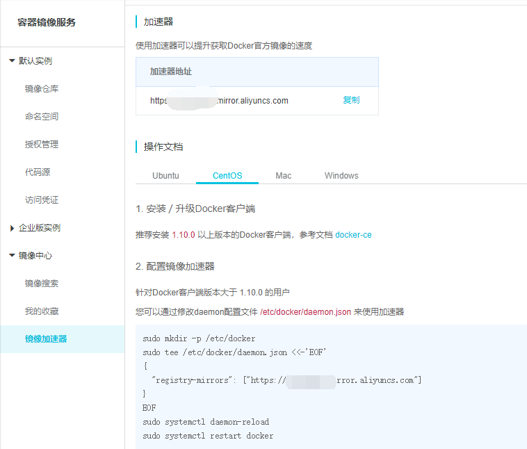

> 当前更多是集群环境，从部署到运维相对工作量大。Docker一次构建，处处运行。
>
> 实验室相关项目最终也决定使用docker部署

<!-- more -->

## 一、Docker安装

参考链接:

http://www.docker.org.cn/book/install/linux.html  

https://docs.docker.com/install/linux/docker-ce/centos/

### 1、依赖检查

> CentOS 7 安装
>
> 依赖要求：Docker需要一个64位系统的Linux系统，内核的版本必须大于3.10
>
> 可以通过 uname -r 来检查内核版本

### 2、安装

#### （1）脚本安装

```bash
sudo yum update # 更新现有yum包
curl -sSL https://get.docker.com/ | sh  # 脚本安装
sudo service docker start # 启动docker服务
sudo docker version # 查看是否启动成功
```

#### （2）yum指令安装

```bash
sudo yum update # 更新现有yum包
# 安装需要的工具和依赖包
sudo yum install -y yum-utils device-mapper-persistent-data lvm2
# 添加repository
sudo yum-config-manager --add-repo https://download.docker.com/linux/centos/docker-ce.repo
# 安装docker-ce
sudo yum install docker-ce docker-ce-cli containerd.io
# 查看可安装的docker版本
yum list docker-ce --showduplicates | sort -r
# 安装指定版本的docker
sudo yum install docker-ce-<VERSION_STRING> docker-ce-cli-<VERSION_STRING> containerd.io
# 启动 docker
sudo systemctl start docker
# 通过运行 hello-image 镜像，测试是否正确安装
sudo docker run hello-world
```

#### （3）离线安装

参考链接：https://blog.csdn.net/u013058742/article/details/80075633 

> 1、下载所需的docker安装包
>
> <https://download.docker.com/linux/centos/7/x86_64/stable/Packages/>
>
> 2、下载所需的依赖
>
> <http://mirrors.163.com/centos/7/os/x86_64/Packages/> 下载如下8个依赖
>
> - audit-libs-python-2.7.6-3.el7.x86_64.rpm
> - checkpolicy-2.5-4.el7.x86_64.rpm
> - libcgroup-0.41-13.el7.x86_64.rpm
> - libseccomp-2.3.1-3.el7.x86_64.rpm
> - libsemanage-python-2.5-8.el7.x86_64.rpm
> - policycoreutils-python-2.5-17.1.el7.x86_64.rpm
> - python-IPy-0.75-6.el7.noarch.rpm
> - setools-libs-3.3.8-1.1.el7.x86_64.rpm
>
> http://mirror.centos.org/centos/7/extras/x86_64/Packages/container-selinux-2.95-2.el7_6.noarch.rpm
>
> 下载 container-selinux-2.95-2.el7_6.noarch.rpm

```bash
# 安装依赖
rpm -ivh *.rpm
# 安装container
rpm -ivh container-selinux-2.9-4.el7.noarch.rpm
# 安装docker
rpm -ivh docker-ce-17.12.0.ce-1.el7.centos.x86_64.rpm
# 启动docker
service dockerstart
# 查看版本及是否已运行
docker version
```

### 3、卸载

```bash
# 列出安装包
yum list installed |grep docker
# 删除安装包
yum -y remove docker-XXX
# 删除镜像、容器等
rm -rf /var/lib/docker
```


## 二、Docker镜像

### 1、切换为阿里云镜像源

进入阿里云镜像仓库库 参考链接：

https://www.cnblogs.com/zhxshseu/p/5970a5a763c8fe2b01cd2eb63a8622b2.html

进入后，根据提示操作，如图：



### 2、Docker状态查询

```bash
docker version # 查看docker版本信息
# 查看docker运行状态
service docker status 
systemctl is-active docker
# 查看运行情况,ps指令和linux类似
docker ps
```

### 3、镜像操作

> 就镜像拉取、提交来说，其实和Git一样，只不过把git换成了docker

#### （1）镜像查看

```bash
# 添加 -a 后会将悬空镜像（none:none）的镜像一并列举出来
docker images [-a]
docker image ls [-a]
# 只显示镜像的id,可以用于批量删除
docker image ls -q
# 只显示仓库名和对应的Tag，首字母大写 {{.Size}}
docker image ls --format "{{.Repository}}\t{{.Tag}}"
# 只查看悬空镜像，除dangling外还有 before、since、label 
docker image ls --filter dangling=true
# 也可以使用reference过滤,如仅显示标签为latest的镜像
docker image ls --filter=reference="*:latest"
```

#### （2）镜像查询与拉取

> 要注意的是latest是一个非强制标签，不保证支线跟仓库中最新的镜像，只能说大多是指向最新的。

> 由于镜像是分层的，所以为节省空间和提升性能，多个镜像之间会共享镜像层，这意味着镜像下载多了后，后面的镜像由于共享镜像层，所需下载的新的数据量就更少。

```bash
# 搜索镜像
docker search tomcat
docker search tomcat --filter "is-official=true"  # 只显示官方镜像
docker search tomcat --filter "is-automated=true" # 自动创建的仓库
# 拉取镜像, [image] 为可选项，可写可不写,写时去掉中括号，如：docker image pull tomcat
docker [image] pull tomcat # 默认拉取tag为latest的版本
docker [image] pull nginx:1.17 # 拉取tag为1.17的nginx
docker [image] pull mysql:5.6.31
```

```bash
# 为准确拉取镜像，也可以通过镜像签名值下载
docker image ls --digests mysql # 查看mysql镜像签名
# 通过镜像签名拉取对应镜像
docker pull mysql:d99ad1a8a2f8859dc986566cc31741c00a050d5fbf9305e7cd74398ade79f36
```

```bash
# 镜像查看,能够查看详细信息及镜像层信息，docker history有类似功能，不过没有inspect严谨
docker image inspect centos:latest
```


#### （3）镜像删除

> docker image rm [OPTIONS] IMAGE [IMAGE...]
>
> 可以多个一起删除，后面可以增加参数：
>
> -f, --force      Force removal of the image
> --no-prune   Do not delete untagged parents

```bash
# 删除指定的镜像
docker image rm mysql:5.6.31 centos:latest
# 批量删除, -f 代表强制删除，因为镜像有实例在运行的话，默认不让删除
docker image rm $(docker image ls -q) -f
```

#### （4）镜像导出与导入

```bash
# 镜像导出 docker save [--help] [-o|--output[=OUTPUT]] IMAGE [IMAGE...]
docker save centos > centos.tar
docker save --output=centos.tar centos:latest
# 镜像导入 docker load [--help] [-i|--input[=INPUT]] [-q|--quiet]
docker load < centos.tar
docker load --input centos.tar
```

## 三、Docker容器

### 1、容器启动（run）

> 详细内容 参考链接：https://www.cnblogs.com/vikings-blog/p/4238062.html
>
> 或者 输入： docker run --help
>
> 调用格式：docker run [OPTIONS] IMAGE [COMMAND] [ARG...] 

> 常用的参数主要有：
>
> + -it : 启动容器后会自动进入容器交互命令行，快捷键**Ctrl+PQ** 断开容器shell连接但是容器后台运行
>
> + -d : 启动容器后，不进入容器命令交互行 
> + --name : 指定容器运行后的名字，若不指定，随机生成
> + -p ：指定交互的端口映射, -p linux_port:docker_container_port
> + -P ：随机分配端口，一般不这样用
> + -v  :  挂在指定volume，用于容器与实际文件交互 -v linux_absolut_path:container_absolute_path
> + --link ：使容器与容器能够互相通信，--link [容器名/id]:[连接名]
> + --restart :利用重启策略自我修复容器，always在重启docker服务后，会自动重启容器(即使在重启服务前停止了该容器)，unless-stopped则不会；on-failure会在容器退出并且返回值不是0的时候重启容器。

```bash
# 以指定镜像运行容器
docker run -d --name tomcat -p 8080:8080 tomcat:latest
docker run -d -p 3306:3306 --name mysql selfbuild_mysql
# 指定挂载volume
cur_path=`pwd` # "="前后别加空格
docker run -d -p 8080:8080 --name tomcat --link mysql:docker_mysql -v ${cur_path}/webapps:/opt/apache-tomcat-9.0.20/webapps centos_tomcat
```

说明：从其他主机访问docker部署的主机8080端口，能够得到docker centos_tomcat镜像实例容器tomcat8080端口的内容，由于项目需要访问mysql，故而需要mysql容器与tomcat容器能够通信，在tomcat中，访问mysql数据库的连接url可以为：

```
jdbc:mysql://docker_mysql:3306/database?useUnicode=true&characterEncoding=UTF-8
```

### 2、容器其他操作

```bash
# 查看所有在运行的容器
docker container ls
docker ps
# 查看所有容器，已停止的容器也会显示
docker container ls -a
docker ps -a
# 停止运行容器
docker kill container_id/container_name
docker stop container_id/container_name
# 启动停止了的容器
docker start container_id/container_name
# 删除未运行的容器
docker container rm container_id/container_name
# 查看容器配置的细节和运行时信息
docker container inspect  container_id/container_name
# 对运行时的容器，运行bash命令
docker container exec container_id/container_name bash_commands
# 后面添加 -it 会连接到容器的shell进程
docker container exec -it container_id/container_name bash_commands
```

## 四、应用容器化(Docker镜像构建)

### 1、镜像构建常用指令

> + ADD  
>   + 将主机目录下文件拷贝到镜像，且会自动处理url和tar压缩包
> + COPY 
>   + 和ADD类似，区别是不会自动解压，从源路径到镜像内目标路径
> + FROM
>   + 基础镜像，当前新镜像基于那个镜像拓展
> + RUN
>   + 构建容器时要运行的bash命令
> + EXPOSE
>   + 创建容器后对外暴露出的端口
> + WORKDIR
>   + 创建容器后，终端默认登陆进入的工作目录
> + ENV
>   + 构建镜像过程中设置的环境变量
> + VOLUME
>   + 容器数据卷，用于数据保存和持久化工作
> + CMD
>   + 指定容器启动时要运行的命令，可以有多个，但是只有最后一个会生效，可在docker run 后通过指令进行参数替换
> + ENTRYPOINT
>   + 容器启动时要运行的命令，目的和CMD一样
> + ONBUILD
>   + 当前镜像被继承使用时，出发该语句后的内容
> + MAINTAINER
>   + 镜像维护者的姓名和邮箱地址

### 2、tomcat mysql构建 Dockerfile


## 五、Docker Compose部署

## 六、Docker Swarm

## 七、Docker网络

## 八、Docker卷与持久化

