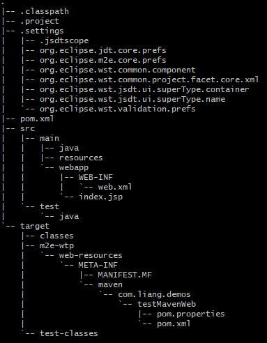

> 关于eclipse建立Web项目后，一些文件夹作用及相关参数设置，做笔记以便后续查阅
>
> 当前主要使用两种方式建立Web项目: Maven Project 和 Dynamic Web Project

<!-- more -->

## 项目配置文件

Dynamic Web Project

> 如图，在建立项目后，文件夹内会生成途中的文件夹和相关参数文件，一般在使用Git和Svn同步项目的时候，只会同步src/和WebContent/两个文件夹，其他文件都不做同步。
>
> + .settings: 保存项目web的相关参数，如：Project Facets等
> + build：默认会将编译生成后的内容保存在build/文件夹
> + src: 存放源码的文件夹，有时候为了方便也会选择自己建立其他文件夹名，只要将其设置为Source Folder就可以了，一般默认会将source Folder的内容生成至classpath(/WEB-INF/classes)。
> + WebContent：存放除源码等文件外的所有文件，如前端页面、静态资源、部分配置文件等，这个文件夹从文件结构来说，相当于项目发布后的根目录(/)，很多资源文件，都是相对这个文件夹来确定位置。
>
> [关于项目根目录下eclipse配置文件的详细介绍](https://blog.csdn.net/huaweitman/article/details/52351394)

Maven Web Project

> 与Dynamic Web Project稍有不同的是：
>
> + WebContent对应这里的Webapp 
> + build对应这里的target
>
> 同时所在的路径有所不同。不过最后发布后的路径和设置有关，故而实际上是一样的。
>
> **需要注意的是：**这里的resources默认是source folder，也就是会发布到classpath路径下，一般用于存放配置文件。前端可能会在Webapp下新建resources文件夹，用于存放静态文件和这个是不同的（只是名字一样），注意别放错位置了。
>
> **Source Foler：**存放源代码及配套的配置文件，默认将其**文件夹中的内容**发布在**classpath**下。在idea中也类似如此，只有标记为Source Folder的文件夹里面才可以新建包（本质上都是文件夹，但是显示时不一样）

同理，在配置spring相关配置文件，设计到文件资源路径的时候，主要通过根目录(Webapp/WebContent)和classpath以相对路径描述资源路径。